# 🔥🔥 Wooble Social Media App  [](https://twitter.com/CharlyKeleb)
Wooble is a fully functional social media app with multiple features built with flutter and dart.

Star⭐ the repo if you like what you see😉.

## ✨ Requirements
* Any Operating System (ie. MacOS X, Linux, Windows)
* Any IDE with Flutter SDK installed (ie. IntelliJ, Android Studio, VSCode etc)
* A little knowledge of Dart and Flutter
* A brain to think 🤓🤓

## Features
 * Custom photo feed 
 * Post photo posts from camera or gallery
   * Like posts
   * Comment on posts
        * View all comments on a post
 * Search for users
 * Realtime Messaging and Sending images
 * Deleting Posts
 * Profile Pages
   * Change profile picture
   * Change username
   * Follow / Unfollow Users
   * Change image view from grid layout to feed layout
   * Add your own bio
 * Notifications Feed showing recent likes / comments of your posts + new followers
 * Swipe to delete notification
 * Dark Mode Support
 * Used Provider to manage state
 

## Screenshots
<p>
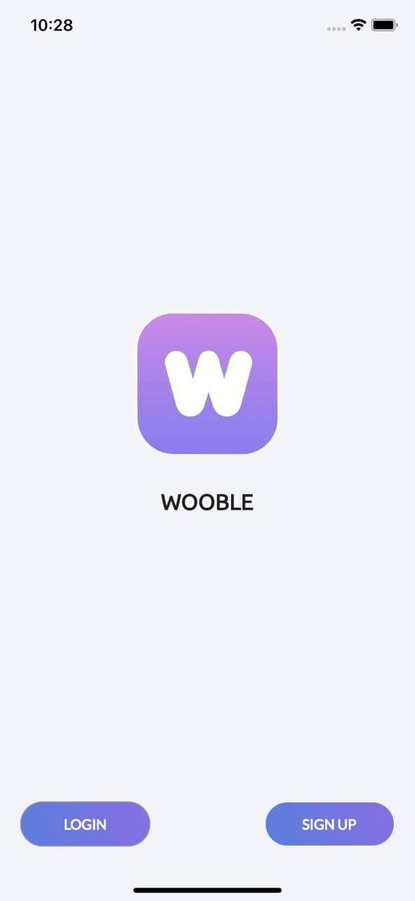 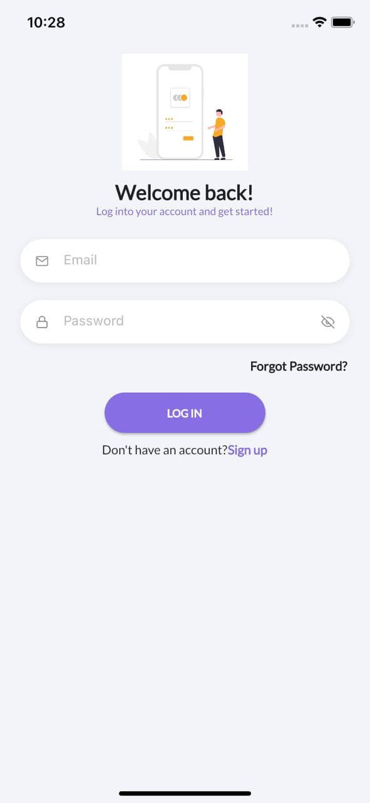
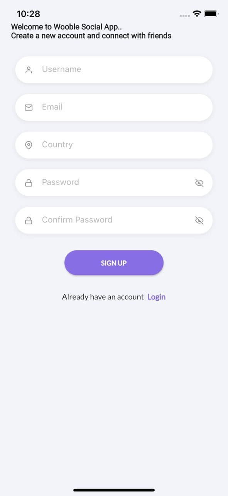 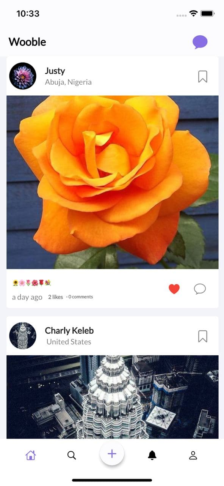
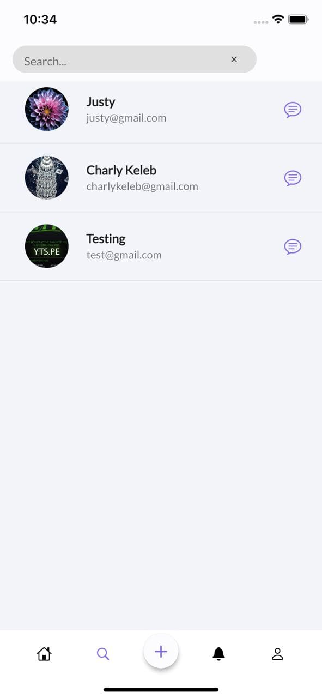 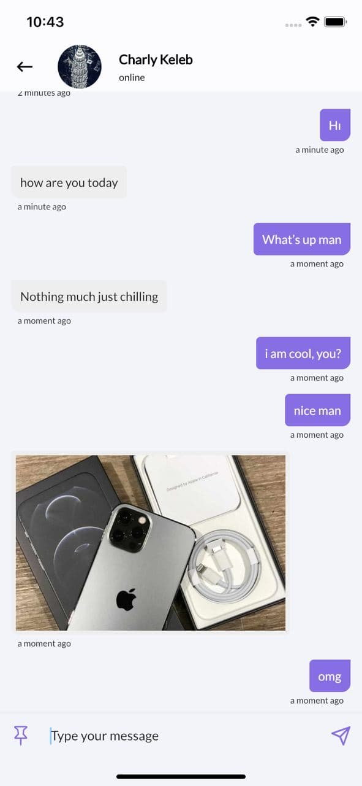
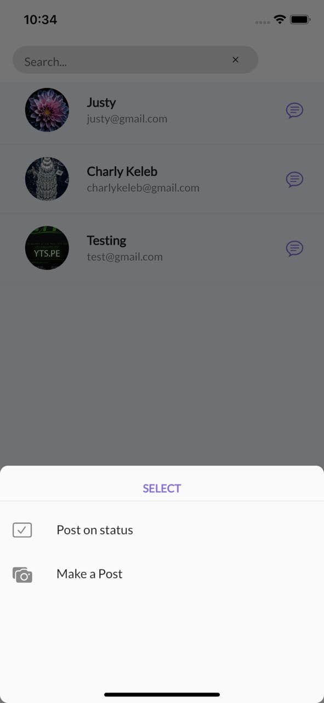 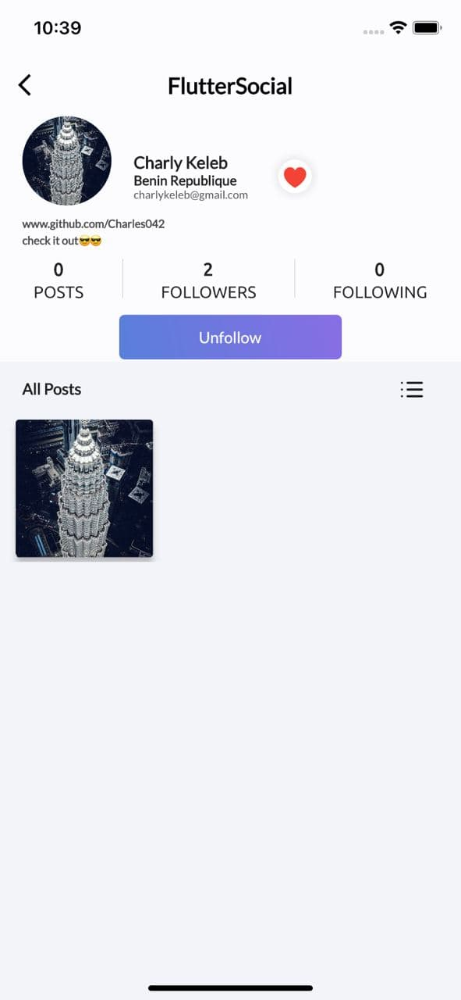
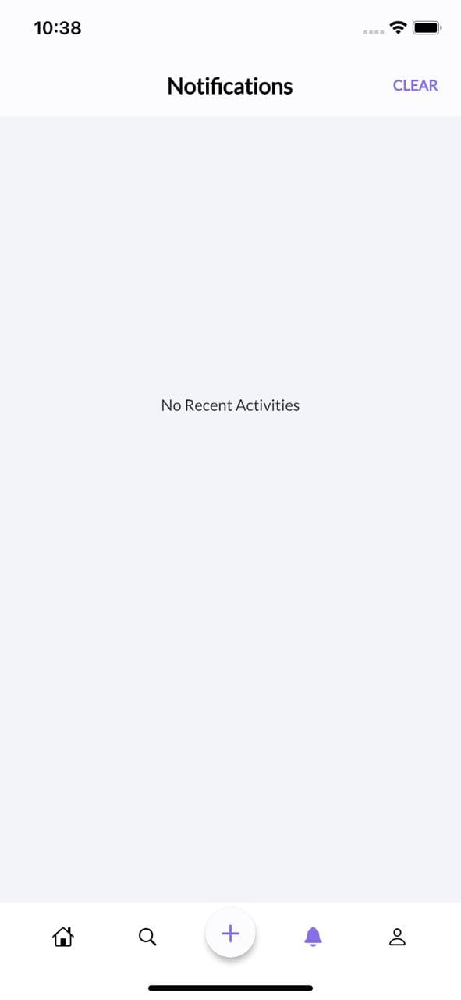 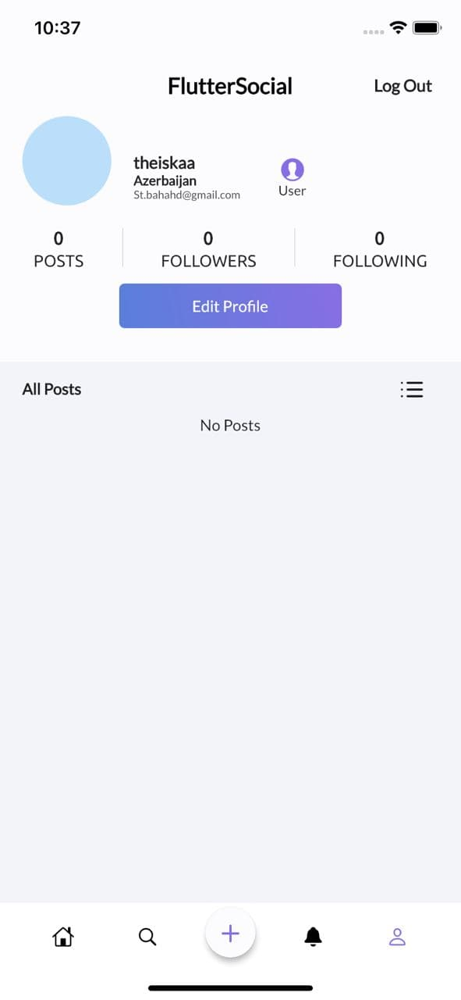
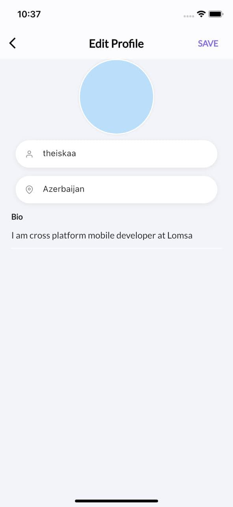 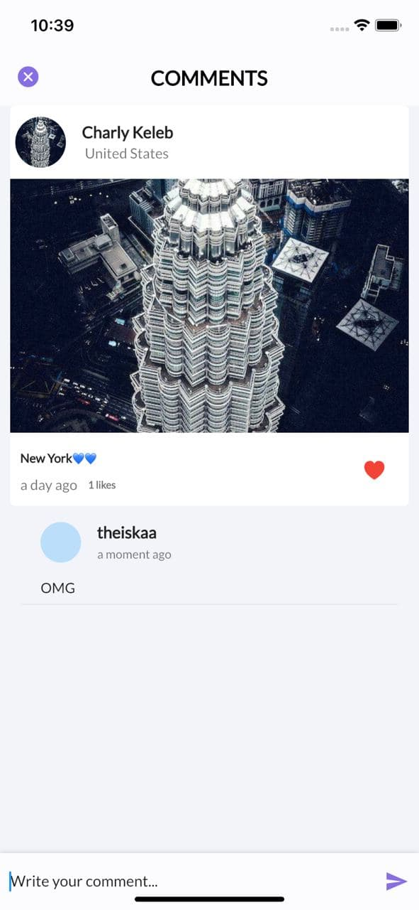
</p>


## Installation

#### 1. [Setup Flutter](https://flutter.dev/docs/get-started/install)

#### 2. Clone the repo

#### 3. Setup the firebase app

- You'll need to create a Firebase instance. Follow the instructions at https://console.firebase.google.com.
- Once your Firebase instance is created, you'll need to enable Google authentication.

* Go to the Firebase Console for your new instance.
* Click "Authentication" in the left-hand menu
* Click the "sign-in method" tab
* Click "Email and Password" and enable it
* Create an app within your Firebase instance for Android, with package name com.yourcompany.news
* Run the following command to get your SHA-1 key:

```
keytool -exportcert -list -v \
-alias androiddebugkey -keystore ~/.android/debug.keystore
```

* In the Firebase console, in the settings of your Android app, add your SHA-1 key by clicking "Add Fingerprint".
* Follow instructions to download google-services.json
* place `google-services.json` into `/android/app/`.

- (skip if not running on iOS)

* Create an app within your Firebase instance for iOS, with your app package name
* Follow instructions to download GoogleService-Info.plist
* Open XCode, right click the Runner folder, select the "Add Files to 'Runner'" menu, and select the GoogleService-Info.plist file to add it to /ios/Runner in XCode
* Open /ios/Runner/Info.plist in a text editor. Locate the CFBundleURLSchemes key. The second item in the array value of this key is specific to the Firebase instance. Replace it with the value for REVERSED_CLIENT_ID from GoogleService-Info.plist

Double check install instructions for both
   - Google Auth Plugin
     - https://pub.dartlang.org/packages/firebase_auth
   - Firestore Plugin
     -  https://pub.dartlang.org/packages/cloud_firestore


# What's Next?
 - [] Animations(liking image)
 - [] Stories['under development]
 - [] Saving posts
 - [] Video Calling ['under development']
 - [] Audio Calling
 - [] Reels
 - [] Sending and Uploading Videos


## 🤓 Author(s)
**Charly Keleb Charles042** [](https://twitter.com/Charlykeleb)
